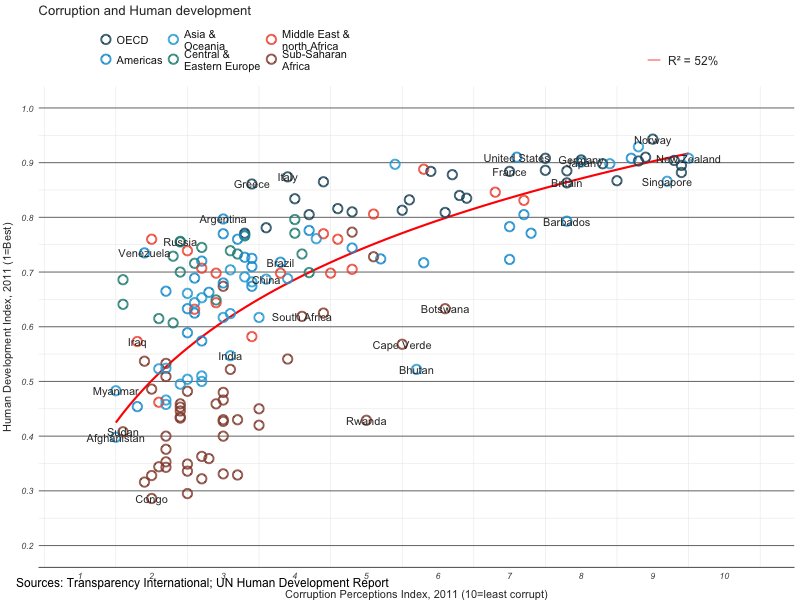

<!--
rmarkdown::render('example.Rmd')

rmarkdown::render('Intro_to_R_markdown_and_ggplot2.Rmd')
housing <- read.csv("dataSets/landdata-states.csv")
# knitr::knit2html
-->

This tutorial was written by the Institute for Quantitative Social Science (Harvard University) and modified for this lab by Kristen Sauby.

# Introduction

<div class="materials-no-ipynb">

## Materials and setup

1. If you have not already done so, create a folder on your computer in which to save all of the files related to this class (I named mine "PCB3601C").
1. Within that folder, create a folder for this lab (I named mine "R_lab").
1. Move the "dataSets.zip" folder there and unzip it.
1. Open RStudio and set the working directory to PCB3601C/R_lab.
	a) go to the "Session" dropdown menu
	b) select "set working directory"
	c) select "choose directory"
	d) navigate to the folder for this lab
1. You will need to have the `ggplot2` package installed for this lab. Unsure whether it is installed or not? Type `library(ggplot2)`. If it is not yet installed, R will give you an error. If you have not yet installed the "ggplot2" package, in R, type `install.packages("ggplot2")` to install.

## Lab Overview

Please make sure to read through the tutorial and instructions. Have a question *after* reading through this? Feel free to ask.

Collaboration is encouraged.

The focus of today's lab includes

1. `ggplot2` graphics--other packages will not be covered
2. being able to generate a report with the figures you have created (in HTML format) by using R markdown.

You are encouraged to explore the `ggplot2` documentation: <http://ggplot2.tidyverse.org/reference/>. There are many useful, simple examples to help you "build" your plot. Even though I have been using `ggplot2` for years, I still look at the `ggplot2` documentation almost every time I build a figure using `ggplot2`!

## What to Turn In

**Create the figures from Exercises I, II, III, and IV and include them in an R markdown file. Then "knit" that R markdown file to create an HTML file;  submit the HTML file to your TA via Canvas (submit via this assignment, specifically: <https://ufl.instructure.com/courses/347379/assignments/3464833>) when you are done with the lab.**

## Why R Markdown?

R Markdown is a great way to write a report that can include R results, figures, and regular text without having to save separate files. This can be much easier than writing a report directly in Word and dragging individual figures over; also, if you have to update anything you have done summarizing your data (e.g., statistical output or even calculating a simple mean) you do not have to manually update it. Just edit your R markdown file and "knit" again to either HTML or Word, and voila, R has done the work for you!

In this lab we will use R Markdown to organize figures created from this lab into *one* HTML file that will be turned in to your TA. You do not have to worry about saving each individual file to a specific place and then dragging them into a Word document; R will create one file including them all.
 
Here are some good resources about R markdown:

- R Markdown, http://rmarkdown.rstudio.com/index.html
- Creating HTML documents in R Markdown, http://rmarkdown.rstudio.com/html_document_format.html
- Markdown cheat sheet, https://github.com/adam-p/markdown-here/wiki/Markdown-Cheatsheet
 
## Why `ggplot2`?

Advantages of ggplot2

-   consistent underlying `grammar of graphics` (Wilkinson, 2005)
-   plot specification at a high level of abstraction
-   very flexible
-   theme system for polishing plot appearance
-   mature and complete graphics system
-   many users, active mailing list

## What Is The Grammar Of Graphics?

The basic idea: independently specify plot building blocks and combine them to create just about any kind of graphical display you want. Building blocks of a graph include:

-   data
-   aesthetic mapping
-   geometric object
-   statistical transformations
-   scales
-   coordinate system
-   position adjustments
-   faceting

## The structure of a `ggplot`


The `ggplot()` function is used to initialize the basic graph structure, then we add to it.  **In other words, we specifying different parts of the plot, and add them together using the `+` operator.** The structure of the code used to create a plot using `ggplot2` looks like this:

```r
# here we tell ggplot2 what data we are using, what our x and y variables are called in that dataset
  ggplot(
	  data = default_data_set, 
         aes(
			 x = default_x_axis_variable,
             y = default_y_axis_variable,
             ...
		),
        ...
  ) +

  		# here we start building our plot
         geom_GEOMTYPE(
			 aes(
				 size = size_variable_for_this_geom, 
                 ...
			 ),
             data = data_for_this_point_geom,
             stat = statistic,
             position = position,
             color = "COLOR",
             ...
		 ) +

   	  	scale_AESTHETICTYPE(
			name = "scale label",
			breaks = where_to_put_tick_marks,
            labels = labels_for_tick_marks,
            ...
		) +
		# here we can dicate how we want our overall plot to appear
    	theme(
			plot.background = element_rect(fill = "gray"),
          	...
		)
```


## Example Data: `Housing prices`

Note that from this point on, you should be able to re-create all figures displayed in this file by copying and pasting the code from the *grey boxes* into the Console in RStudio. Anything that R prints as a result of the code (including warnings and comments) is shown in the white boxes that immediately follow the grey boxes.

Let's look at housing prices.

```{r}
  housing <- read.csv("dataSets/landdata-states.csv")
  head(housing[1:5])
```

(Data from <https://www.lincolninst.edu/subcenters/land-values/land-prices-by-state.asp>)

## `ggplot2` VS Base Graphics


Compared to base graphics, `ggplot2`

-   is more verbose for simple graphics
-   is less verbose for complex / custom graphics
-   does not have methods (data should always be in a `data.frame`)
-   uses a different system for adding plot elements

## `ggplot2` VS Base for simple graphs

Base graphics histogram example:

```{r}
  hist(housing$Home.Value)
```

`ggplot2` histogram example:

```{r}
  library(ggplot2)
  ggplot(housing, aes(x = Home.Value)) +
    geom_histogram()
```

In this scenario, it is easier to use the "base" graphics because the code is **shorter and simpler.**

## `ggplot2` Base graphics VS `ggplot` for more complex graphs:


Base colored scatter plot example:

```{r}
  plot(Home.Value ~ Date,
       data=subset(housing, State == "MA"))
  points(Home.Value ~ Date, col="red",
         data=subset(housing, State == "TX"))
  legend(19750, 400000,
         c("MA", "TX"), title="State",
         col=c("black", "red"),
         pch=c(1, 1))
```

`ggplot2` colored scatter plot example:

```{r}
  ggplot(subset(housing, State %in% c("MA", "TX")),
         aes(x=Date,
             y=Home.Value,
             color=State))+
    geom_point()
```

`ggplot2` excels in this example because it is **shorter, simpler, and hopefully easier for you to "read."**

<div class="materials-no-ipynb">


# Geometric Objects And Aesthetics


## Aesthetic Mapping


In ggplot land *aesthetic* means "something you can see". Examples include:

-   position (i.e., on the x and y axes)
-   color ("outside" color)
-   fill ("inside" color)
-   shape (of points)
-   linetype
-   size

Each type of geom accepts only a subset of all aesthetics--refer to the geom help pages to see what mappings each geom accepts. Aesthetic mappings are set with the `aes()` function.

Geometic Objects (`geom`)
-------------------------

Geometric objects are the actual marks we put on a plot. Examples include:

-   points (`geom_point`, for scatter plots, dot plots, etc)
-   lines (`geom_line`, for time series, trend lines, etc)
-   boxplot (`geom_boxplot`, for, well, boxplots!)

A plot must have at least one geom; there is no upper limit. You can add a geom to a plot using the `+` operator

You can get a list of available geometric objects using the code below

```{r}
  help.search("geom_", package = "ggplot2")
```

OR simply type `geom_<tab>` in any good R IDE (such as Rstudio or ESS) to see a list of functions starting with `geom_`

**OR browsing the documentation website, <http://ggplot2.tidyverse.org/reference/>. (This is the option I usually use!)**

Points (Scatterplot)
--------------------

Now that we know about geometric objects and aesthetic mapping, we can make a ggplot. `geom_point` requires mappings for x and y, all others are optional.

```{r}
  hp2001Q1 <- subset(housing, Date == 2011) # here we created a new dataframe from the "housing" dataset for all rows in which Date is equal to 2011.
  
  ggplot(hp2001Q1,
         aes(y = Structure.Cost, x = Land.Value)) +
    geom_point()
```

Lines (Prediction Line)
-----------------------

A plot constructed with `ggplot` can have more than one geom. In that case the mappings established in the `ggplot()` call are plot defaults that can be added to or overridden. Our plot could use a regression line:

```{r}
# here the "lm" function fits a linear model (straight line) to the data 
# the "predict" function helps us to draw the straight line predicted by the linear model generated with the "lm" function

  hp2001Q1$pred.SC <- predict(lm(Structure.Cost ~ Land.Value, data = hp2001Q1))

  p1 <- ggplot(hp2001Q1, aes(x = Land.Value, y = Structure.Cost))

  p1 + geom_point(aes(color = Home.Value)) +
    geom_line(aes(y = pred.SC))
```

Smoothers
---------

Not all geometric objects are simple shapes--the smooth geom includes a line and a ribbon. Here `geom_smooth()` uses the method = 'loess', a statistical method that we will NOT delve into in this class; all we need to know here is that it creates a curved line fit to the data.

```{r}
  p1 +
    geom_point(aes(color = Home.Value)) +
    geom_smooth()
```

Text (Label Points)
-------------------

Each `geom` accepts a particular set of mappings--for example `geom_text()` accepts a `labels` mapping.

```{r}
  p1 + 
    geom_text(aes(label=State), size = 3)
```

Aesthetic Mapping VS Assignment
-------------------------------

Note that variables are mapped to aesthetics with the `aes()` function, while fixed aesthetics are set outside the `aes()` call. This sometimes leads to confusion, as in this example:

```{r}
  p1 +
    geom_point(aes(size = 2),# incorrect! 2 is not a variable
               color="red") # this is fine -- all points red
```

Mapping Variables To Other Aesthetics
-------------------------------------

Other aesthetics are mapped in the same way as x and y in the previous example.

```{r}
  p1 +
    geom_point(aes(color=Home.Value, shape = region))
```

Exercise I
----------

The data for the exercises is available in the `dataSets/EconomistData.csv` file. Read it in with

```{r}
  dat <- read.csv("dataSets/EconomistData.csv")
```

(To read it in properly make sure that you have set your working directory to folder in which you have saved the "dataSets" folder!)

Original sources for these data are <http://www.transparency.org/content/download/64476/1031428> <http://hdrstats.undp.org/en/indicators/display_cf_xls_indicator.cfm?indicator_id=103106&lang=en>

These data consist of *Human Development Index* and *Corruption Perception Index* scores for several countries.

**You will create an R markdown file that you will "knit" later to create a HTML file to give to your TA when you are done with the lab. I suggest once you complete figure 5, knit your R markdown file to make sure that you are able to generate the HTML file. To get started, download and start with this R markdown file (<https://github.com/ksauby/workshops/blob/master/R/Rgraphics/example.Rmd>), in which I have already included the code for Figure 1 below.**

**Create each of the following figures:**

1.  **Create a scatter plot with CPI on the x axis and HDI on the y axis.**
2.  **Color the points in the previous plot blue.**
3.  **Color the points in the previous plot according to *Region*.**
4.  **Make the size of the points bigger by setting size to 2.**
5.  **Make the size of the points proportional to HDI.Rank.**
6.  **Re-create a scatter plot with CPI on the x axis and HDI on the y axis (as you did in the previous exercise). Overlay a smoothing line on top of the scatter plot using the default method.**
7.  **Overlay a *straight* smoothing line on top of the scatter plot using the *lm* method. Hint: see `?stat_smooth`.**

Scales
======

Scales: Controlling Aesthetic Mapping
-------------------------------------

Aesthetic mapping (i.e., with `aes()`) only says that a variable should be mapped to an aesthetic. It doesn't say *how* that should happen. Describing what colors/shapes/sizes etc. to use is done by modifying the corresponding *scale*. In `ggplot2` scales include

-   position
-   color and fill
-   size
-   shape
-   line type

Scales are modified with a series of functions using a `scale_<aesthetic>_<type>` naming scheme. Try typing `scale_<tab>` to see a list of scale modification functions.

Common Scale Arguments
----------------------

The following arguments are common to most scales in ggplot2:

`name`: the first argument gives the axis or legend title

`limits`: the minimum and maximum of the scale

`breaks`: the points along the scale where labels should appear

`labels`: the labels that appear at each break

Specific scale functions may have additional arguments; for example, the `scale_color_continuous` function has arguments `low` and `high` for setting the colors at the low and high end of the scale.

Scale Modification Examples
---------------------------

Start by constructing a dotplot showing the distribution of home values by Date and State. Note that color varies by Date.

```{r}
  p3 <- ggplot(housing,
               aes(x = State,
                   y = Home.Price.Index)) + 
          theme(legend.position="top",
                axis.text=element_text(size = 6))
  (p4 <- p3 + geom_point(aes(color = Date),
                         alpha = 0.5,
                         size = 1.5,
                         position = position_jitter(width = 0.25, height = 0)))
```

Now modify the label for the x axis, as well as the "breaks" for the color scale. Compare this figure to the previous one.

```{r}
  p4 + scale_x_discrete(name="State Abbreviation") +
    scale_colour_gradient(breaks = c(1976, 1994, 2013))
```

Next change the low and high values to blue and red:

```{r}
  p4 +
    scale_x_discrete(name="State Abbreviation") +
	scale_colour_gradient(low = "blue", high = "red", breaks = c(1976, 1994, 2013))

```

We can use the function `muted` from the `scales` package to modify colors.

First, install the `scales` package:

```{r, eval=F}
install.packages("scales")
```

```{r}
library(scales)
  p4 +
    scale_color_continuous(breaks = c(1976, 1994, 2013),
                           low = muted("blue"), high = muted("red"))
```

Using different color scales
----------------------------

ggplot2 has a wide variety of color scales; here is an example using `scale_color_gradient2` to interpolate between three different colors.

```{r}
  p4 +
    scale_color_gradient2(name="",
                          breaks = c(1976, 1994, 2013),
                          low = muted("blue"),
                          high = muted("red"),
                          mid = "gray60",
                          midpoint = 1994)
```

Available Scales
----------------

You can browse the available scales here: <http://ggplot2.tidyverse.org/reference/index.html#section-scales>.

Note that in RStudio you can type `scale_` followed by TAB to get the whole list of available scales.

Exercise II
------------

**Create each of the following figures:**

1.  **Create a scatter plot with CPI on the x axis and HDI on the y axis. Color the points to indicate region. Modify the x, y, and color scales so that they have more easily-understood names (e.g., spell out "Human development Index" instead of "HDI").**
2.  **Modify the color scale to use specific values of your choosing. Hint: see `?scale_color_manual`.**


Faceting
========

-   Faceting is `ggplot2` parlance for **small multiples**
-   The idea is to create **separate** graphs for **subsets** of data
-   `ggplot2` offers two functions for creating small multiples:
    1.  `facet_wrap()`: define subsets as the levels of a *single* grouping variable
    2.  `facet_grid()`: define subsets as the crossing of *two* grouping variables
-   Facilitates comparison among groups within a dataset

What is the trend in housing prices in each state?
--------------------------------------------------

Here we will work to compare the trend in housing prices among different US states. Start by using a technique we already know--map State to color:

```{r}
  p5 <- ggplot(housing, aes(x = Date, y = Home.Value))
  p5 + geom_line(aes(color = State))  
```

There are two problems here--there are too many states to distinguish each one by color, and the lines obscure one another.

Faceting to the rescue
----------------------

We can remedy the deficiencies of the previous plot by faceting by state rather than mapping state to color.

```{r}
  (p5 <- p5 + geom_line() +
     facet_wrap(~State, ncol = 10))
```

Are there any states that jump out to you as outliers, i.e., as having different relationships between date and home value, compared to other states?

There is also a `facet_grid()` function for faceting in two dimensions.

Exercise III
------------

**Create the following figure:**

1. **Create a scatterplot with CPI on the x axis, HDI on the y axis, add a straight smoothing line, and facet and color by Region.**


Themes
======

The `ggplot2` theme system handles non-data plot elements such as

-   Axis labels
-   Plot background
-   Facet label backround
-   Legend appearance

Built-in themes include:

-   `theme_gray()` (default)
-   `theme_bw()`
-   `theme_classc()`

```{r}
  p5 + theme_linedraw()
```

```{r}
  p5 + theme_light()
```

Overriding theme defaults
-------------------------

Specific theme elements can be overridden using `theme()`. For example:

```{r}
  p5 + theme_minimal() +
    theme(text = element_text(color = "turquoise"))
```

All theme options are documented in `?theme`.

Creating and saving new themes
------------------------------

You can create new themes, as in the following example:

```{r}
  theme_new <- theme_bw() +
    theme(plot.background = element_rect(size = 1, color = "blue", fill = "black"),
          text=element_text(size = 12, family = "serif", color = "ivory"),
          axis.text.y = element_text(colour = "purple"),
          axis.text.x = element_text(colour = "red")
		  )

  p5 + theme_new
```

If you create a custom theme, think about the following: will others be able to read it? How will it look when printed? 

Exercise IV
------------

**Create the following figure:**

1. **Create a scatterplot with CPI on the x axis, HDI on the y axis, add a straight smoothing line, and facet and color by Region. Use your own customized theme.**


# Resources

- General information about specifying types of points and lines and colors: https://www.statmethods.net/advgraphs/parameters.html

## ggplot2

- http://ggplot2.tidyverse.org/index.html

## Markdown

- R Markdown, http://rmarkdown.rstudio.com/index.html
- Creating HTML documents in R Markdown, http://rmarkdown.rstudio.com/html_document_format.html
- Markdown cheat sheet, https://github.com/adam-p/markdown-here/wiki/Markdown-Cheatsheet


Optional Challenge for Motivated Students: Recreate This `Economist` Graph
=======================

Graph source: <http://www.economist.com/node/21541178>

Building off of the graphics you created in the previous exercises, put the finishing touches to make it as close as possible to this original graph from *The Economist* magazine:


Challenge Solution<span class="tag" data-tag-name="prototype"></span>
=====================================================================

Lets start by creating the basic scatter plot, then we can make a list of things that need to be added or changed. The basic plot loogs like this:

```{r}
  dat <- read.csv("dataSets/EconomistData.csv")

  pc1 <- ggplot(dat, aes(x = CPI, y = HDI, color = Region))
  pc1 + geom_point()
```

To complete this graph we need to:

- add a trend line
- change the point shape to open circle
- change the order and labels of Region
- label select points
- fix up the tick marks and labels
- move color legend to the top
- title, label axes, remove legend title
- theme the graph with no vertical guides
- add model R<sup>2</sup> (hard)
- add sources note (hard)
- final touches to make it perfect (use image editor for this)

Adding the trend line
---------------------

Adding the trend line is not too difficult, though we need to guess at the model being displyed on the graph. A little bit of trial and error leds to

```{r}
  (pc2 <- pc1 +
     geom_smooth(aes(group = 1),
                 method = "lm",
                 formula = y ~ log(x),
                 se = FALSE,
                 color = "red")) +
     geom_point()
```

Notice that we put the `geom_line` layer first so that it will be plotted underneath the points, as was done on the original graph.

Use open points
---------------

This one is a little tricky. We know that we can change the shape with the `shape` argument, what what value do we set shape to? The example shown in `?shape` can help us:

```{r}
  ## A look at all 25 symbols
  df2 <- data.frame(x = 1:5 , y = 1:25, z = 1:25)
  s <- ggplot(df2, aes(x = x, y = y))
  s + geom_point(aes(shape = z), size = 4) + scale_shape_identity()
  ## While all symbols have a foreground colour, symbols 19-25 also take a
  ## background colour (fill)
  s + geom_point(aes(shape = z), size = 4, colour = "Red") +
    scale_shape_identity()
  s + geom_point(aes(shape = z), size = 4, colour = "Red", fill = "Black") +
    scale_shape_identity()
```

This shows us that *shape 1* is an open circle, so

```{r}
  pc2 +
    geom_point(shape = 1, size = 4)
```

That is better, but unfortunately the size of the line around the points is much narrower than on the original. This is a frustrating aspect of ggplot2, and we will have to hack around it. One way to do that is to multiple point layers of slightly different sizes.

```{r}
  (pc3 <- pc2 +
     geom_point(size = 4.5, shape = 1) +
     geom_point(size = 4, shape = 1) +
     geom_point(size = 3.5, shape = 1))
```

Labelling points
----------------

This one is tricky in a couple of ways. First, there is no attribute in the data that separates points that should be labelled from points that should not be. So the first step is to identify those points.

```{r}
  pointsToLabel <- c("Russia", "Venezuela", "Iraq", "Myanmar", "Sudan",
                     "Afghanistan", "Congo", "Greece", "Argentina", "Brazil",
                     "India", "Italy", "China", "South Africa", "Spane",
                     "Botswana", "Cape Verde", "Bhutan", "Rwanda", "France",
                     "United States", "Germany", "Britain", "Barbados", "Norway", "Japan",
                     "New Zealand", "Singapore")
```

Now we can label these points using `geom_text`, like this:

\#+END<sub>SRC</sub>

```{r}
  (pc4 <- pc3 +
    geom_text(aes(label = Country),
              color = "gray20",
              data = subset(dat, Country %in% pointsToLabel)))
```

This more or less gets the information across, but the labels overlap in a most unpleasing fashion. We can use the `ggrepel` package to make things better, but if you want perfection you will probably have to do some hand-adjustment.

```{r}
  library("ggrepel")
  pc3 +
    geom_text_repel(aes(label = Country),
              color = "gray20",
              data = subset(dat, Country %in% pointsToLabel),
              force = 10)
```

Change the region labels and order
----------------------------------

Thinkgs are starting to come together. There are just a couple more things we need to add, and then all that will be left are themeing changes.

Comparing our graph to the original we notice that the labels and order of the Regions in the color legend differ. To correct this we need to change both the labels and order of the Region variable. We can do this with the `factor` function.

```{r}
  dat$Region <- factor(dat$Region,
                       levels = c("EU W. Europe",
                                  "Americas",
                                  "Asia Pacific",
                                  "East EU Cemt Asia",
                                  "MENA",
                                  "SSA"),
                       labels = c("OECD",
                                  "Americas",
                                  "Asia &\nOceania",
                                  "Central &\nEastern Europe",
                                  "Middle East &\nnorth Africa",
                                  "Sub-Saharan\nAfrica"))
```

Now when we construct the plot using these data the order should appear as it does in the original.

```{r}
  pc4$data <- dat
  pc4
```

Add title and format axes
-------------------------

The next step is to add the title and format the axes. We do that using the `scales` system in ggplot2.

```{r}
  library(grid)
  (pc5 <- pc4 +
    scale_x_continuous(name = "Corruption Perceptions Index, 2011 (10=least corrupt)",
                       limits = c(.9, 10.5),
                       breaks = 1:10) +
    scale_y_continuous(name = "Human Development Index, 2011 (1=Best)",
                       limits = c(0.2, 1.0),
                       breaks = seq(0.2, 1.0, by = 0.1)) +
    scale_color_manual(name = "",
                       values = c("#24576D",
                                  "#099DD7",
                                  "#28AADC",
                                  "#248E84",
                                  "#F2583F",
                                  "#96503F")) +
    ggtitle("Corruption and Human development"))
```

Theme tweaks
------------

Our graph is almost there. To finish up, we need to adjust some of the theme elements, and label the axes and legends. This part usually involves some trial and error as you figure out where things need to be positioned. To see what these various theme settings do you can change them and observe the results.

```{r}
  library(grid) # for the 'unit' function
  (pc6 <- pc5 +
    theme_minimal() + # start with a minimal theme and add what we need
    theme(text = element_text(color = "gray20"),
          legend.position = c("top"), # position the legend in the upper left 
          legend.direction = "horizontal",
          legend.justification = 0.1, # anchor point for legend.position.
          legend.text = element_text(size = 11, color = "gray10"),
          axis.text = element_text(face = "italic"),
          axis.title.x = element_text(vjust = -1), # move title away from axis
          axis.title.y = element_text(vjust = 2), # move away for axis
          axis.ticks.y = element_blank(), # element_blank() is how we remove elements
          axis.line = element_line(color = "gray40", size = 0.5),
          axis.line.y = element_blank(),
          panel.grid.major = element_line(color = "gray50", size = 0.5),
          panel.grid.major.x = element_blank()
          ))
```

Add model R<sup>2</sup> and source note
---------------------------------------

The last bit of information that we want to have on the graph is the variance explained by the model represented by the trend line. Lets fit that model and pull out the R<sup>2</sup> first, then think about how to get it onto the graph.

```{r}
  (mR2 <- summary(lm(HDI ~ log(CPI), data = dat))$r.squared)
```

OK, now that we've calculated the values, let's think about how to get them on the graph. ggplot2 has an `annotate` function, but this is not convenient for adding elements outside the plot area. The `grid` package has nice functions for doing this, so we'll use those.

And here it is, our final version!

```{r}
  library(grid)
  png(file = "images/econScatter10.png", width = 800, height = 600)
  pc6 
  grid.text("Sources: Transparency International; UN Human Development Report",
           x = .02, y = .03,
           just = "left",
           draw = TRUE)
  grid.segments(x0 = 0.81, x1 = 0.825,
                y0 = 0.90, y1 = 0.90,
                gp = gpar(col = "red"),
                draw = TRUE)
  grid.text(paste0("R² = ",
                   as.integer(mR2*100),
                   "%"),
            x = 0.835, y = 0.90,
            gp = gpar(col = "gray20"),
            draw = TRUE,
            just = "left")

  dev.off()
```



Comparing it to the original suggests that we've got most of the important elements, though of course the two graphs are not identical.

